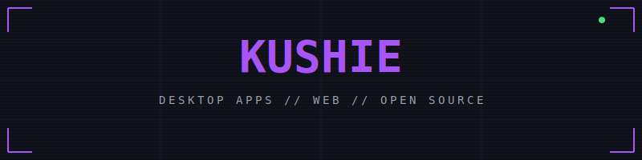

<!--
    ██╗  ██╗██╗   ██╗███████╗██╗  ██╗██╗███████╗
    ██║ ██╔╝██║   ██║██╔════╝██║  ██║██║██╔════╝
    █████╔╝ ██║   ██║███████╗███████║██║█████╗
    ██╔═██╗ ██║   ██║╚════██║██╔══██║██║██╔══╝
    ██║  ██╗╚██████╔╝███████║██║  ██║██║███████╗
    ╚═╝  ╚═╝ ╚═════╝ ╚══════╝╚═╝  ╚═╝╚═╝╚══════╝
-->

<div align="center">



</div>

<div align="center">
<br/>

```
┌──────────────────────────────────────────────────┐
│                                                  │
│  > Full-stack dev with a weakness                │
│    for native apps, lossless audio,              │
│    and anything with a CRT.                      │
│                                                  │
│  Location: France                                │
│  Status: Open to interesting projects            │
│  Pronouns: she/her                               │
│                                                  │
└──────────────────────────────────────────────────┘
```

<br/>


<br/>


&nbsp;


<br/>

<sub><a href="#-tech_stack">tech</a> · <a href="#-featured_projects">projects</a> · <a href="#-retro_corner">retro</a> · <a href="#-connect">connect</a></sub>

<br/><br/>

```
╭─────────────────────────────────────────────────╮
│  > currently_building                            │
│                                                  │
│  [▶] FLACidal           — lossless desktop app  │
│  [▶] FLACidal Mobile    — iOS/Android port      │
│  [▶] YouFLAC Mobile     — iOS/Android port      │
│  [▶] OpenDrop-VJ        — SvelteKit · Electron  │
╰─────────────────────────────────────────────────╯
```

<br/>
</div>

## `// TECH_STACK`

<table>
<tr>
<td width="33%" valign="top">

### 

<p>


</p>

</td>
<td width="33%" valign="top">

### 

<p>


</p>

</td>
<td width="33%" valign="top">

### 

<p>


</p>

</td>
</tr>
</table>

<br/>

## `// FEATURED_PROJECTS`

<div align="center"><table width="100%">
<tr>
<td align="center" width="33%">

<br/><sub>Tidal → FLAC lossless<br/>HI_RES 24-bit · lossless pipeline</sub>
<br/><br/>


<br/>
<a href="https://github.com/kushiemoon-dev/FLACidal"></a>
</td>
<td align="center" width="33%">

<br/><sub>YouTube 4K video<br/>Tidal · Qobuz · Amazon → MKV</sub>
<br/><br/>


<br/>
<a href="https://github.com/kushiemoon-dev/YouFLAC"></a>
</td>
<td align="center" width="33%">

<br/><sub>Multi-deck VJ app<br/>NestDrop alt · Linux/Win/Mac</sub>
<br/><br/>


<br/>
<a href="https://github.com/kushiemoon-dev/OpenDrop-VJ"></a>
</td>
</tr>
<tr>
<td align="center" width="33%">

<br/><sub>Trans health tracker<br/>100% local · IndexedDB</sub>
<br/><br/>


<br/>
<a href="https://github.com/kushiemoon-dev/chrysalide"></a>
</td>
<td align="center" width="33%">

<br/><sub>Club management app<br/>Events · Scores · Stats</sub>
<br/><br/>


<br/>
<sub>Client project · Private repo</sub>
</td>
<td align="center" width="33%">

<br/><sub>Portfolio · i18n FR/EN/DE<br/>Lighthouse 90+</sub>
<br/><br/>


<br/>
<a href="https://kushie.dev"></a>
</td>
</tr>
</table></div>

<br/>

## `// OTHER_PROJECTS`

<div align="center"><table width="100%">
<tr>
<td align="center" width="33%">

<br/><sub>Local-first PWA<br/>for Tuya dehumidifiers</sub>
<br/><br/>


<br/>
<a href="https://github.com/kushiemoon-dev/purify-tuya"></a>
</td>
<td align="center" width="33%">

<br/><sub>FLACidal on iOS & Android<br/>lossless · offline sync</sub>
<br/><br/>


<br/>
<a href="https://github.com/kushiemoon-dev/FLACidal"></a>
</td>
<td align="center" width="33%">

<br/><sub>YouFLAC on iOS & Android<br/>private · WIP</sub>
<br/><br/>


<br/>
<sub>Private repo · WIP</sub>
</td>
</tr>
<tr>
<td align="center" width="33%">

<br/><sub>Site web associatif<br/>Au fil des saisons</sub>
<br/><br/>


<br/>
<sub>Private repo</sub>
</td>
<td align="center" width="33%">

<br/><sub>Tool for plural systems · private<br/>WIP</sub>
<br/><br/>


<br/>
<sub>Private repo · WIP</sub>
</td>
<td align="center" width="33%">

<br/><sub>Voice training · trans & non-binary<br/>100% local · EN/FR</sub>
<br/><br/>


<br/>
<a href="https://github.com/kushiemoon-dev/voice-lab"></a>
</td>
</tr>
<tr>
<td align="center" width="33%">

<br/><sub>Geological map of France<br/>BD Charm-50 · 14 regions</sub>
<br/><br/>


<br/>
<a href="https://github.com/kushiemoon-dev/geo-france"></a>
&nbsp;
<a href="https://geo-france.kushie.dev"></a>
</td>
</tr>
</table></div>

<br/>

## `// STATS`

<div align="center">


<br/><br/>


<br/><br/>


<br/><br/>


</div>

<br/>

## `// RETRO_CORNER`

<div align="center">

```
╭──────────────────────────────────────────────╮
│          ~ vintage tech collector ~           │
╰──────────────────────────────────────────────╯
```

### `consoles/`

<table>
<tr>
<td align="center">

<br/><sub>Luma3DS CFW</sub>
</td>
<td align="center">

<br/><sub>R4 Gold</sub>
</td>
<td align="center">

<br/><sub>OG Sony</sub>
</td>
</tr>
<tr>
<td align="center">

<br/><sub>64-bit era</sub>
</td>
<td align="center">

<br/><sub>Modded · Homebrew</sub>
</td>
<td align="center">

<br/><sub>VR · sideloaded</sub>
</td>
</tr>
</table>

### `audio_video/`

<table>
<tr>
<td align="center">

<br/><sub>Rockbox · 256GB flash<br/>2000mAh · U2 edition</sub>
</td>
<td align="center">

<br/><sub>Vintage sound system</sub>
</td>
<td align="center">

<br/><sub>Trans Continent<br/>The real display</sub>
</td>
<td align="center">

<br/><sub>Compact 7.1MP · 2007<br/>3× zoom · point & shoot</sub>
</td>
</tr>
</table>

### `homelab/`

<table>
<tr>
<td align="center">

<br/><sub>Multi-node · 2005/2010 hardware<br/>Old machines, new tricks</sub>
</td>
</tr>
</table>

### `now_playing/`

<a href="https://tidal.com/playlist/c3e58adb-ed7a-43dd-917c-f65657320f10"></a>

### `philosophy/`

```
┌──────────────────────────────────────────────────┐
│  Planned obsolescence is a skill issue.          │
│  These machines have decades left.               │
└──────────────────────────────────────────────────┘
```

</div>

<br/>

## `// CONNECT`

<div align="center">

```
┌──────────────────────────────────────┐
│         let's build something        │
└──────────────────────────────────────┘
```

<a href="https://kushie.dev/contact">

</a>
&nbsp;
<a href="https://discord.gg/kushiemoon">

</a>
&nbsp;
<a href="mailto:kushie.dev@icloud.com">

</a>

<br/><br/>

<a href="https://github.com/kushiemoon-dev">

</a>

</div>

<br/>

---

<div align="center">

```
╔════════════════════════════════════════════════════╗
║                                                    ║
║          Thanks for stopping by!                   ║
║                                                    ║
║   "The best code is free.                          ║
║    The second best is readable code."              ║
║                                                    ║
╚════════════════════════════════════════════════════╝
```

<sub>Last updated: June 2026 · Made with insomnia and mass amounts of tea</sub>

</div>
